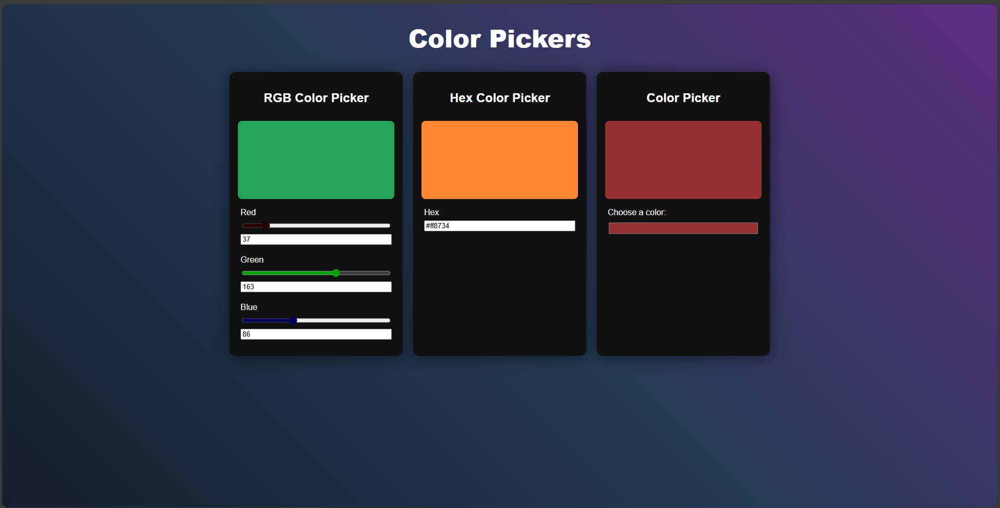

# HueMate - The React Color Picker Tool

A simple and interactive color picker application built with React.js and CSS. This application provides three different methods to select and preview colors.

## Features

### 🎨 Three Color Picker Methods

1. **RGB Picker**: Interactive sliders and input fields to select colors using RGB values (Red, Green, Blue)
2. **Hex Color Picker**: Input field to enter hexadecimal color codes with live preview
3. **Native Color Picker**: HTML5 color input for visual color selection from a color palette

## Technologies Used

- React.js 19.2.0
- CSS3
- Vite (Build tool)
- HTML5

## Getting Started

### Prerequisites

- Node.js (v14 or higher)
- npm or yarn

### Installation

1. Clone the repository

```bash
git clone <your-repository-url>
cd color-picker
```

2. Install dependencies

```bash
npm install
```

3. Start the development server

```bash
npm run dev
```

4. Open your browser and navigate to `http://localhost:5173`

## Available Scripts

- `npm run dev` - Starts the development server
- `npm run build` - Builds the app for production
- `npm run preview` - Preview the production build
- `npm run lint` - Run ESLint for code quality

## Project Structure

```
src/
├── App.jsx          # Main application component
├── App.css          # Main styles
├── Picker.jsx       # RGB color picker component
├── HexPicker.jsx    # Hexadecimal color picker component
├── OnsitePicker.jsx # Native HTML5 color picker component
├── main.jsx         # Application entry point
└── index.css        # Global styles
```

## How to Use

### RGB Picker

- Use the sliders to adjust Red, Green, and Blue values (0-255)
- Or enter specific RGB values in the input fields
- See the color preview update in real-time

### Hex Picker

- Enter a valid hexadecimal color code (e.g., #FF5733)
- The color preview will update automatically

### Native Color Picker

- Click on the color picker to open your browser's color palette
- Select any color from the palette
- The selected color will be displayed

## Screenshots


